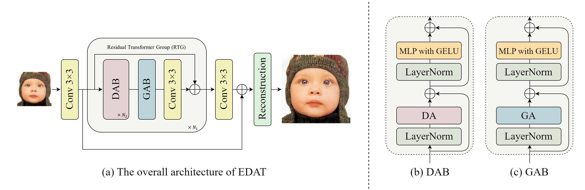
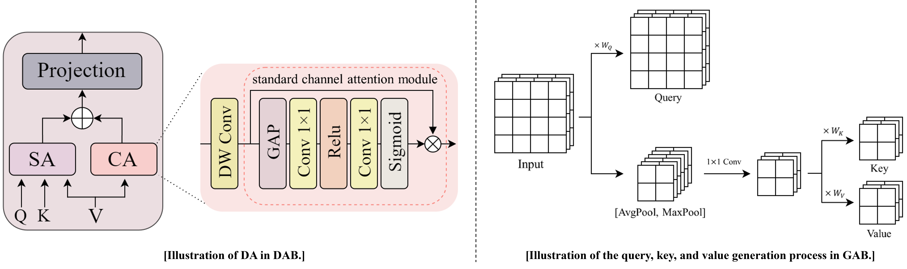
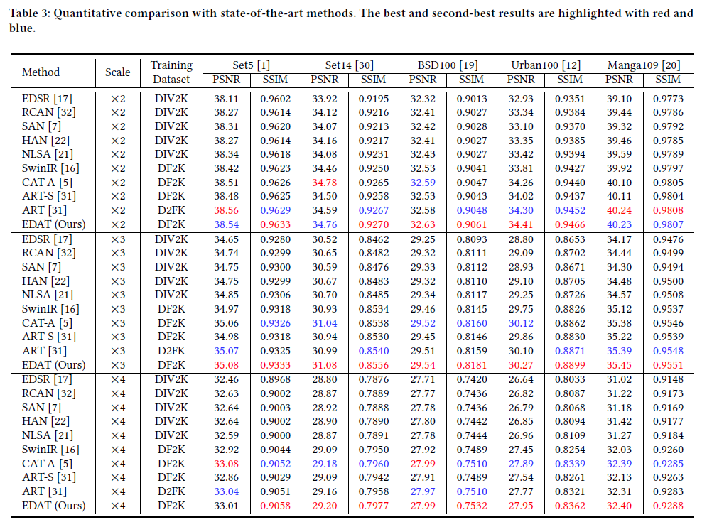

# Efficient Dual Attention Transformer for Image Super-Resolution
This repository is the official PyTorch implementation of **"Efficient Dual Attention Transformer for Image Super-Resolution".**

[paper] [[visual results]](https://drive.google.com/drive/folders/1b-JuaImuZ3j9hdBnQX8pRSWg7zOB2gJC) [[pretrained models]](https://drive.google.com/drive/folders/1xu2bz72zmdzbpZanOc9F__C8ctL3FH3z)

---

> **Abstract :** *Research based on computationally efficient local-window selfattention has been actively advancing in the field of image superresolution (SR), leading to significant performance improvements. However, in most recent studies, local-window self-attention focuses only on spatial dimension, without sufficient consideration of the channel dimension. Additionally, extracting global information while maintaining the efficiency of local-window self-attention, still remains a challenging task in image SR. To resolve these problems, we propose a novel efficient dual attention transformer (EDAT). Our EDAT presents a dual attention block (DAB) that empowers the exploration of interdependencies not just among features residing at diverse spatial locations but also among distinct channels. Moreover, we propose a global attention block (GAB) to achieve efficient global feature extraction by reducing the spatial size of the keys and values. Our extensive experiments demonstrate that our DAB and GAB complement each other, exhibiting a synergistic effect. Furthermore, based on the two attention blocks, DAB and GAB, our EDAT achieves state-of-the-art results on five benchmark datasets.*

 

<p align="center">

---

|                     SR (x4)                  |                        HQ                                              | [SwinIR](https://github.com/JingyunLiang/SwinIR) |  [CAT-A](https://github.com/zhengchen1999/CAT)      |                  EDAT (Ours)                   |
| :------------------------------------------: | :-----------------------------------------------:                     | :----------------------------------------------: | :-------------------------------------------: | :-------------------------------------------: |
| |      | | | |
| |      | | | |

## Requirements
- python 3.8
- pyTorch >= 1.8.0
- NVIDIA GPU + [CUDA](https://developer.nvidia.com/cuda-downloads)

### Installation
```bash
git clone https://github.com/soobin419/EDAT.git
cd EDAT
pip install -r requirements.txt
python setup.py develop
```

## Datasets

Used training and testing sets can be downloaded as follows:

| Training Set                                                 |                         Testing Set                          |                        Visual Results                        |
| :----------------------------------------------------------- | :----------------------------------------------------------: | :----------------------------------------------------------: |
| [DIV2K](https://data.vision.ee.ethz.ch/cvl/DIV2K/) (800 training images) +  [Flickr2K](https://cv.snu.ac.kr/research/EDSR/Flickr2K.tar) (2650 images) [complete dataset DF2K [download](https://drive.google.com/file/d/1TubDkirxl4qAWelfOnpwaSKoj3KLAIG4/view?usp=share_link)] | Set5 + Set14 + BSD100 + Urban100 + Manga109 [[download](https://drive.google.com/file/d/1n-7pmwjP0isZBK7w3tx2y8CTastlABx1/view?usp=sharing)] | [Google Drive](https://drive.google.com/drive/folders/1b-JuaImuZ3j9hdBnQX8pRSWg7zOB2gJC)|

Download training and testing datasets and put them into the corresponding folders of `datasets/`. See [datasets](datasets/README.md) for the detail of the directory structure.

## Training

- Download [training](https://drive.google.com/file/d/1TubDkirxl4qAWelfOnpwaSKoj3KLAIG4/view?usp=share_link) (DF2K, already processed) and [testing](https://drive.google.com/file/d/1yMbItvFKVaCT93yPWmlP3883XtJ-wSee/view?usp=sharing) (Set5, Set14, BSD100, Urban100, Manga109, already processed) datasets, place them in `datasets/`.

- Run the following scripts. The training configuration is in `options/train/`.

  ```shell
  # EDAT, input=64x64, 4 GPUs, batch size=8 per GPU
  python -m torch.distributed.launch --nproc_per_node=4 --master_port=2414 basicsr/train.py -opt options/train/train_EDAT_SRx2_from_scratch.yml --launcher pytorch
  python -m torch.distributed.launch --nproc_per_node=4 --master_port=2414 basicsr/train.py -opt options/train/train_EDAT_SRx3_finetune_from_SRX2.yml --launcher pytorch
  python -m torch.distributed.launch --nproc_per_node=4 --master_port=2414 basicsr/train.py -opt options/train/train_EDAT_SRx4_finetune_from_SRX2.yml --launcher pytorch
  ```

- The training experiment is in `experiments/`.

## Testing

### Test images with HR

- Download the pre-trained [models](https://drive.google.com/drive/folders/1xu2bz72zmdzbpZanOc9F__C8ctL3FH3z) and place them in `experiments/pretrained_models/`.

  We provide pre-trained models for image SR: EDAT (x2, x3, x4).

- Download [testing](https://drive.google.com/file/d/1yMbItvFKVaCT93yPWmlP3883XtJ-wSee/view?usp=sharing) (Set5, Set14, BSD100, Urban100, Manga109) datasets, place them in `datasets/`.

- Run the following scripts. The testing configuration is in `options/test/` (e.g., [test_SR_X2.yml](options/test/test_SR_X2.yml)).


  ```shell 
  # EDAT, reproduces results in Table 2 of the main paper
  python basicsr/test.py -opt options/test/test_SR_X2.yml
  python basicsr/test.py -opt options/test/test_SR_X3.yml
  python basicsr/test.py -opt options/test/test_SR_X4.yml
  ```

- The output is in `results/`.

### Test images without HR

- Download the pre-trained [models](https://drive.google.com/drive/folders/1xu2bz72zmdzbpZanOc9F__C8ctL3FH3z) and place them in `experiments/pretrained_models/`.

  We provide pre-trained models for image SR: EDAT (x2, x3, x4).

- Put your dataset (single LR images) in `datasets/single`. Some test images are in this folder.

- Run the following scripts. The testing configuration is in `options/test/` (e.g., [test_EDAT_single_x2.yml](options/test/test_EDAT_single_x2.yml)).

    Note 1: The default model is DWT. You can use other models like DWT-S by modifying the YML.

  ```shell
  # Test on your dataset
  python basicsr/test.py -opt options/test/test_EDAT_single_x2.yml
  python basicsr/test.py -opt options/test/test_EDAT_single_x3.yml
  python basicsr/test.py -opt options/test/test_EDAT_single_x4.yml
  ```

- The output is in `results/`.

## Results

We achieved state-of-the-art performance. Detailed results can be found in the paper. All visual results of EDAT can be downloaded [here](https://drive.google.com/drive/folders/1b-JuaImuZ3j9hdBnQX8pRSWg7zOB2gJC).

<details>
<summary>Click to expan</summary>

- results in Table 3 of the main paper

<p align="center">
  
</p>

- visual comparison (x4) in the main paper

<p align="center">
  
</p>
</details>

## Acknowledgements

This code is built on  [BasicSR](https://github.com/XPixelGroup/BasicSR).
